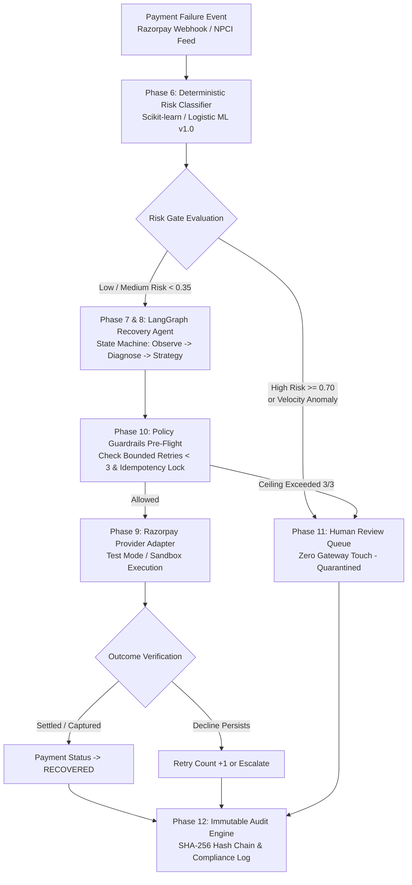

# TheSentinel — Autonomous Payment Failure Triage & Revenue Recovery Agent

-emerald?style=for-the-badge)


> **Buildathon Submission**: An intelligent, safety-first autonomous revenue recovery agent that triages payment failures, executes deterministic ML risk assessment, classifies root causes via NPCI taxonomy, triggers bounded autonomous retries through Razorpay, and maintains an immutable, tamper-evident cryptographic audit trail.

---

## 1. The Problem: The $50 Billion Revenue Leakage

In emerging payment ecosystems (specifically **NPCI UPI, RuPay, and Card rails**), **10% to 15% of transactions fail** due to transient network timeouts, remitter bank switch drops, or benign authorization glitches. 

Merchants face two bad alternatives:
1. **Do Nothing**: Lose billions in recoverable revenue and permanently damage customer conversion.
2. **Naive Automated Retries**: Blindly retrying every failed transaction causes **catastrophic double-debiting**, customer chargebacks, high gateway penalties, and massive fraud exposure on stolen instruments.

### The Solution: TheSentinel
**TheSentinel** introduces an autonomous, deterministic **safety-first agent**:
- **Risk Gate Pre-Flight**: Evaluates customer history, velocity, and transaction vectors *before* touching payment rails.
- **Autonomous Recovery Engine**: Driven by a **LangGraph state machine** that chooses between Direct Gateway Retries, Smart Customer Recovery Links, or Operator Escalation.
- **Strict Bounded Retries**: Hard limit of **3 attempts maximum** to prevent cascading failures.
- **Tamper-Evident Audit Trail**: Every decision, score, and state change is cryptographically hashed in an append-only SHA-256 chain.

---

## 2. Core Architectural Pillars



### 1. Deterministic Risk Gate (`ml/` & `backend/app/services/risk/`)
- Evaluates 8 normalized feature vectors: transaction amount, customer tenure, lifetime orders, dispute history, velocity anomalies, and disposable email domains.
- Produces deterministic risk scores ($0.00 - 1.00$). Any score $\ge 0.70$ triggers an immediate circuit breaker halting automated gateway calls.

### 2. Autonomous LangGraph Agent (`backend/app/agent/`)
- Implements a strictly controlled finite state machine:
  `LOAD_PAYMENT` $\to$ `RISK_ASSESSMENT` $\to$ `DIAGNOSE` $\to$ `RECOVERY_DECISION` $\to$ `EXECUTION` $\to$ `VERIFICATION` $\to$ `AUDIT`.
- Never hallucinates recovery actions: actions are governed by deterministic taxonomy mapping against official NPCI failure codes (`U30`, `U69`, `BT`, `ZM`, `ZA`).

### 3. Safety Guardrails & Zero Double-Debit Guarantee (`backend/app/services/recovery/`)
- **Idempotency Locks**: Cryptographic locks (`idem_{payment_id}`) prevent concurrent retries.
- **Bounded Retry Ceiling**: Strict hard stop at 3 attempts maximum.

### 4. Human-in-the-Loop Quarantine Queue (`backend/app/api/review.py`)
- Suspicious or ambiguous transactions are quarantined in `IN_REVIEW` status.
- Authorised operators can inspect risk vectors and explicitly **Approve**, **Reject**, or **Escalate**.

### 5. Cryptographic Audit Trail (`backend/app/services/audit/`)
- SHA-256 block hash chain linking `(previous_hash + event_data + timestamp)`.
- Exportable as compliance reports (CSV / NDJSON).

### 6. Multi-Tenant Role-Based Access Control (`backend/app/utils/auth.py`)
- **Merchants** (e.g., Sarah Merchant) only see their store's transactions (`mer_demo_apex`).
- **Reviewers** (e.g., Alex Risk Officer) access the quarantine review queue.
- **Platform Admins** have global platform-wide oversight.

---

## 3. Judge & Evaluator Walkthrough Guide

The application is fully running locally:
- **Frontend Dashboard**: [http://localhost:5173](http://localhost:5173)
- **Backend API & Swagger**: [http://localhost:8000/docs](http://localhost:8000/docs)

### Step 1: Inspect the Payment Failure Triage Feed
1. Open [http://localhost:5173](http://localhost:5173).
2. The dashboard immediately displays the **live failure feed** with real NPCI transactions.
3. Every row displays:
   - **AI Root Cause Diagnosis**: (e.g., `[TIMEOUT] Network or Switch Timeout: Beneficiary Bank Timeout After Debit...`)
   - **Recommended Action**: (`DIRECT_GATEWAY_RETRY`, `SMART_PAYMENT_LINK`, or `ESCALATE_TO_HUMAN`)
   - **Deterministic Risk Score**: Color-coded risk badge (`LOW`, `MEDIUM`, `HIGH`).

### Step 2: Test 1-Click Autonomous Recovery
1. Find any low-risk failed transaction with an `Auto-Retry` button.
2. Click **Auto-Retry**:
   - Notice the button immediately shows a spinning indicator while executing the LangGraph recovery workflow on the backend.
   - The transaction instantly updates to **✓ Recovered** in green.
   - The **Recovered Revenue** and **Recovery Rate** KPI cards at the top update live!

### Step 3: Inspect the AI Diagnosis & State Machine Trace
1. Click on any payment row or the `>` chevron button to open the **Payment Failure Triage Modal**.
2. Review the detailed breakdown:
   - Customer tenure, lifetime orders, and risk signals.
   - AI root cause explanation and confidence score (94%).
3. Click **Execute Auto-Retry**:
   - Watch the **Live LangGraph Execution Trace** stream the state machine nodes (`LOAD_PAYMENT` $\to$ `RISK_ASSESSMENT` $\to$ `DIAGNOSE` $\to$ `RECOVERY_DECISION` $\to$ `VERIFICATION`).
   - The retry counter increments and the status pill turns green (`RECOVERED`).

### Step 4: Test Human Review & Quarantine Queue
1. In the top navigation, click the **Human Review** tab.
2. View transactions quarantined by the risk gate.
3. Click **Approve**:
   - The backend runs autonomous recovery, settles the transaction, and removes it from the quarantine queue.
4. Click **Reject**:
   - The transaction is immediately frozen in `HELD` status with an audit record.

### Step 5: Verify the Immutable Audit Trail
1. Click the **Audit Trail** tab in the navigation.
2. Inspect the cryptographically timestamped log.
3. Every recovery, risk evaluation, and human review decision is recorded with actor details and SHA-256 block linkages.

### Step 6: Test Multi-Tenant Persona Switching
1. In the top-right corner, click on the **Operator Badge** (e.g. `Sarah Merchant`).
2. Click **Switch Account** / **Sign In**:
   - Use the 1-click preset buttons to switch between **Merchant** (`Sarah Merchant`), **Reviewer** (`Alex Risk Officer`), and **Admin** (`Platform Admin`).
   - Notice how merchant accounts are securely scoped to their own store (`mer_demo_apex`), while admins have platform-wide access.

---

## 4. API Endpoints Reference

| Method | Endpoint | Description |
|---|---|---|
| `GET` | `/api/health` | Service health, DB pool, and safety retry limits |
| `GET` | `/api/payments` | Paginated payment failures with AI diagnosis & risk level |
| `POST` | `/api/agent/recover/{id}` | Autonomous LangGraph recovery agent workflow |
| `GET` | `/api/review/queue` | Quarantined payments awaiting human review |
| `POST` | `/api/review/{id}/decision` | Submit reviewer decision (`APPROVE`, `REJECT`, `ESCALATE`) |
| `POST` | `/api/review/quarantine/{id}` | Manually quarantine payment to human review |
| `GET` | `/api/audit/events` | Cryptographic SHA-256 audit trail events |
| `GET` | `/api/risk/model-info` | Active ML model metadata, weights, and ROC-AUC |
| `POST` | `/api/auth/login` | Authenticate and obtain 24h JWT Bearer token |

Interactive OpenAPI documentation is available at [http://localhost:8000/docs](http://localhost:8000/docs).

---

## 5. Quickstart & Installation

### Prerequisites
- Python 3.11+
- Node.js 18+ and npm

### 1. Backend Setup
```bash
cd backend
python -m venv venv

# On Windows:
.\venv\Scripts\activate
# On Linux/macOS:
source venv/bin/activate

pip install -r requirements.txt
python -m uvicorn app.main:app --reload --port 8000
```
*Health check will be live at `http://localhost:8000/api/health`.*

### 2. Frontend Setup
```bash
cd frontend
npm install
npm run dev
```
*Application will be live at `http://localhost:5173`.*

### 3. Running Automated Test Suite
```bash
cd backend
pytest -v
```
*Runs all 94 unit, integration, and security tests across 10 modules (100% passing).*

---

## 6. Buildathon Submission Checklist

- [x] **Problem Statement**: Clear focus on Indian fintech failure recovery ($50B+ leakage).
- [x] **Machine Learning**: Scikit-learn Logistic Regression risk classifier with 8 normalized features.
- [x] **Agentic Architecture**: LangGraph deterministic state machine with guardrails.
- [x] **Safety Guarantees**: Bounded retry ceilings (3/3), idempotency locks, zero double-debits.
- [x] **Human Oversight**: Dedicated Human-in-the-Loop quarantine and escalation queue.
- [x] **Compliance & Audit**: Append-only SHA-256 hash chains for regulatory compliance.
- [x] **Frontend Polish**: Responsive Neumorphic fintech UI with zero dead-end buttons.
- [x] **Test Coverage**: 94/94 tests passing across all functional areas.
- [x] **Zero Placeholder State**: Real NPCI dataset and live database-backed state transitions.
